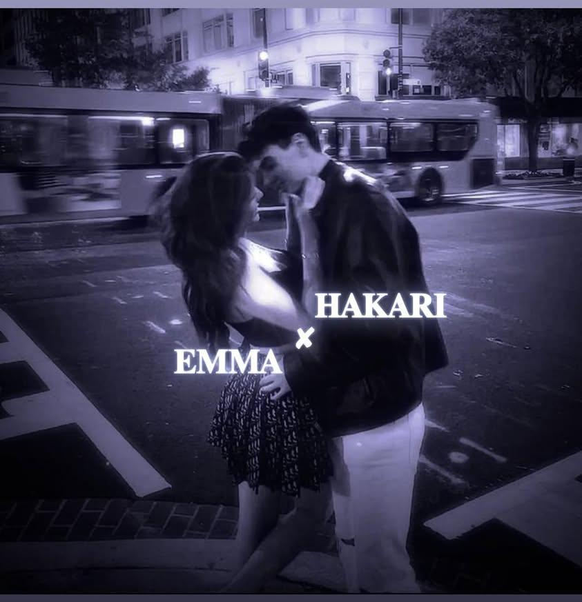

🌌 ZOHA POWER BOT — COSMIC OMEGA ENGINE 👑

  

---

🧠 COSMIC OVERVIEW

👑 Zoha Power Bot is a next-generation WhatsApp automation platform

Built for:

⚡ Extreme performance
💀 Maximum reliability
🎮 Real-time interaction
🎬 Media supremacy
🤖 AI intelligence
🌐 Cloud deployment

This is not just a bot — it’s a complete command engine

---

⚡ COSMIC CAPABILITIES

🤖 AI COMMAND MATRIX

.ai <question>
.img <keyword>

✨ Human-level responses
🖼️ Ultra HD image retrieval
⚡ Instant processing

---

🎬 MEDIA SUPREMACY CORE

Command	Power

.video	Multi-site HD video download
.song	High-quality music extraction
.compress	Advanced video compression

Powered by:

👉 yt-dlp
👉 FFmpeg

---

🎮 INTERACTIVE COSMIC GAMES

🎯 WORD CHAIN — PvP ENGINE

.wc start
.wc join
.wc begin
.wc word <word>
.wc status
.wc end

✔ Competitive gameplay
✔ Difficulty scaling
✔ Anti-repeat logic
✔ Turn-based system

---

🎲 LUDO — MULTIPLAYER CORE

.ludo start
.ludo join
.ludo roll
.ludo move <1-4>
.ludo board
.ludo status
.ludo end

✔ Real dice mechanics
✔ Token physics
✔ Capture system
✔ Board rendering
✔ Win detection

---

⚙️ CONTROL SYSTEM

Command	Function

.alive	System status
.ping	Latency measurement
.react	Auto reactions
.menu	Command panel
.help	Full guide

---

🌐 QUANTUM QR AUTH PANEL

Automatic web interface for WhatsApp login.

Ideal for:

🚀 VPS
🚀 Railway
🚀 Render
🚀 Replit
🚀 Sevalla

Open:

http://localhost:3000

Scan QR and activate.

---

🧠 TECHNOLOGY MATRIX

Baileys — WhatsApp API

Node.js

Express.js

Google Gemini AI

yt-dlp

FFmpeg

SerpAPI

PureImage

---

📦 DEPLOYMENT PROTOCOL

Clone Repository

git clone https://github.com/yourusername/zoha-power-bot.git
cd zoha-power-bot

---

Install Dependencies

npm install

---

Required Software

Install globally:

Node.js 18+

yt-dlp

FFmpeg

---

Environment Setup

Create .env

GEMINI_API_KEY=your_key_here
SERPAPI_KEY=your_key_here
PORT=3000

---

Launch Engine

node index.js

---

🛡️ STABILITY SYSTEMS

✔ Auto reconnect
✔ Crash protection
✔ Download locking
✔ Temp cleanup
✔ Group compatibility
✔ Robust error handling

---

👑 COSMIC CREDITS

Creators: ZOHA & HER HUSBAND
Engine: Zoha Ultimate Core
Edition: Cosmic God Mode

---

⚠️ DISCLAIMER

Educational use only.
Follow platform rules and policies.

---

🌌 Powered by Zoha Engine — Beyond Mortal Software

---

